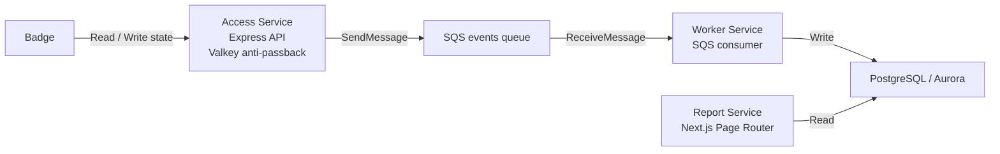

# Architecture

## Overview

## Responsibilities

- `access`
  - 接收 `POST /check`
  - 用 Valkey 維護 anti-passback 狀態
  - 發送 `access.checked` event 到 SQS

- `worker`
  - long polling SQS
  - 驗證 event
  - 以 idempotent `upsert` 寫入 DB

- `report`
  - 提供 `GET /`、`GET /report`、`GET /api/report`
  - 只讀 PostgreSQL / Aurora

## Local Development Mapping

- `postgres`: 本地資料庫
- `valkey`: anti-passback cache
- `localstack`: 模擬 SQS

本地開發時，`pnpm local:up` 會啟動這三個依賴並建立 queue。
